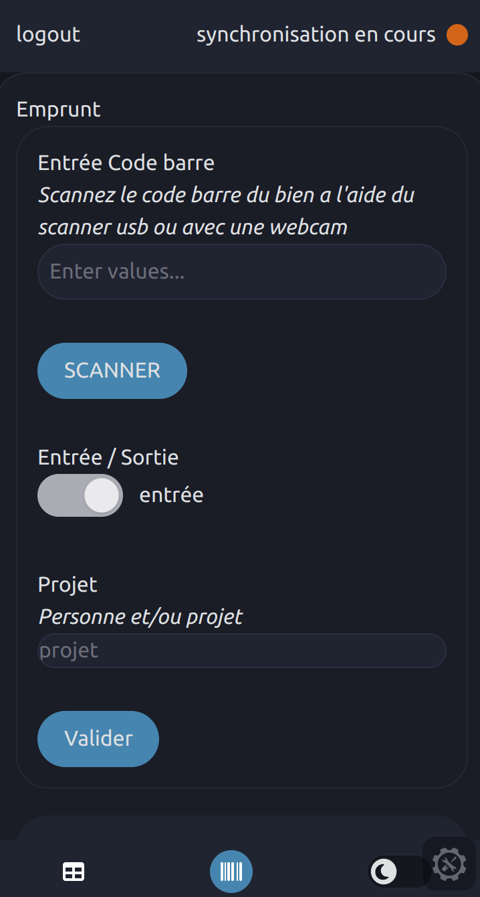

# 🗃 Gestion_inventaire


Gestion d'inventaire est un outil destiné à la gestion des entrée et des sorties des items de la techshop de l'urbanlab
Utilise notion comme base de données

## Installation

### 🐋 Docker

Une image docker est disponible sur le [docker hub](https://hub.docker.com/r/erasme/gestion_inventaire)

#### 🚀 Déploiement

##### Quick start

Si vous souhaitez tester l'application rapidement lancez cette commande docker

```bash
docker run -p 5173:5173 \
-e PRIVATE_NOTION_TOKEN="votre_token_notion" \
-e PRIVATE_NOTION_DB_ID="votre_id_de_db_notion" \
-e PUBLIC_PASSWORD="mdp_pour_acces_au_front" \
-e PUBLIC_REFRESH_INTERVAL=2 \
erasme/gestion_inventaire:dev
```

##### Docker Compose

L'app peut être déployée avec docker compose

```bash
cp .env.example .env # ajuster les variables d'environnement
docker-compose up -d
```

Le front sera disponible sur **https://localhost:5173**

**:warning:  Attention : il est important d'utiliser le https pour acceder au front car la camera ne fonctionne pas en http**

### ⚙️ Utiliser comme environnement de dev

```bash
cp .env.example .env # ajuster les variables d'environnement
docker-compose up -d
docker cp gestion-inventaire-frontend:/app/node_modules .
```
